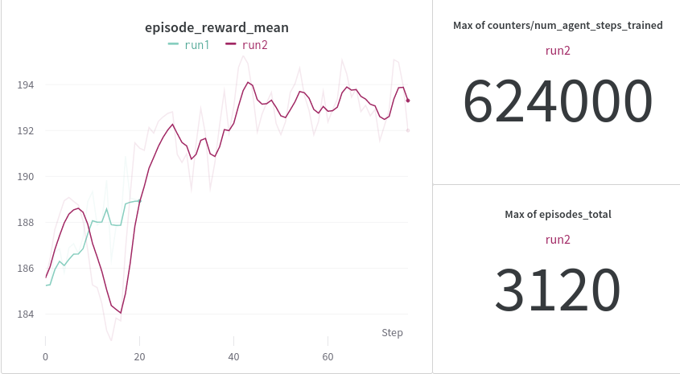

# AntiJam Project

This is a Reinforcement Learning system that trains
a traffic light agent to optimally switch based on
real time traffic observations.

The optimization goal is the minimization
of wasted fuel - fuel used while stuck in traffic.

Each traffic light sees cars in the entire city,
other traffic light states and it's own position.

The PPO (Proximal Policy Optimization) agent has
been trained in such an environment.

Results have been compared with a baseline
model (switching lights every X ticks).
The learned PPO agent outperforms the baseline.

# Demo

Baseline agent on the left, trained PPO on the right.

# Training report

Total computational time was 6 h.

# Installation

- install python 3.10 and pytorch
- `pip install -r requirements.txt`

# Training

With enough RAM, VRAM, CPU cores and a good GPU run:
- `python train.py`

# Simulation

Specify the trained checkpoint path in `simulation.py` and run:
- `python simulation.py`
